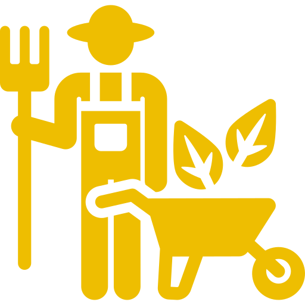
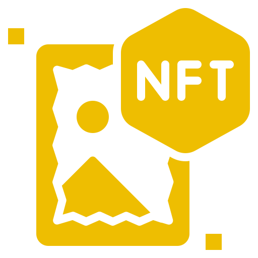
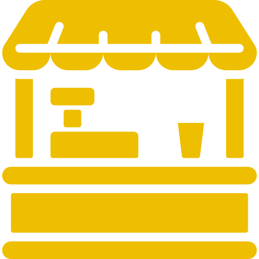

# Introduction

### What Is DevlinDefi?

DevlinDefi is the most efficient way to Stake Earn NFT and Farming. By our new protocol and Tokenomics Enjoy highest apr.

### Earn&#x20;

####  DDT Farm

Token and lp user deposited automatically deposit to another Farm and Pools like biswap and reward use for buyback&#x20;

####  NFT Farm

User can deposit token and lp to DDTFarm and earn power.by power user can mint NFT for deposited to NFTStake

####  NFTStake

User can deposit NFT minted from NFTFarm and earn DDT reward

### Tokenomics & Emissions

* Ticker: POD
* Contract Address: 0xAe32Ce9A1e1A4dE29c8716f92D554ae7DF4c07f9 testnet
* Chains: BNB
* POD Emissions/block: 2

###  Liquidity

coming soon

###  Gaming

coming soon

###  NFT Market

coming soon
